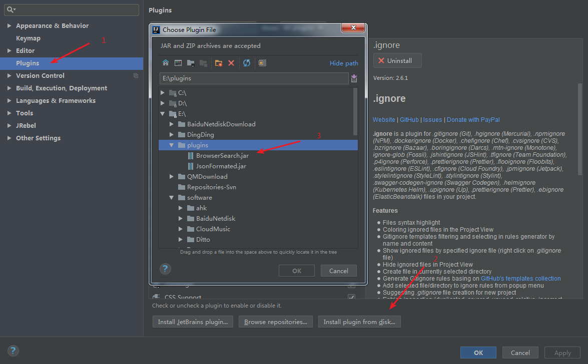
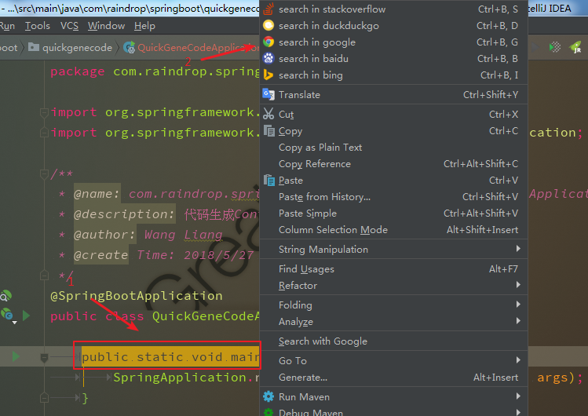
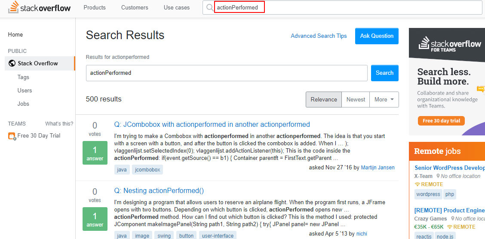

### This is a intellij Idea plugin，Provides a built-in search method，Can pass shortcut keys or right click

[中文注释](https://github.com/727474430/BrowserSearch/blob/master/README_CN.md)

- Bing Search: **Ctrl + B + I**
- Baidu Search: **Ctrl + B + B**
- Google Search: **Ctrl + B + G**
- Duckduckgo Search: **Ctrl + B + D**
- StackOverflow Search: **Ctrl + B + S**

### How to use.

* **Download BrowserSearch.jar**

* **Add To Intellij Idea Plugin**

  

* **Select need to search content Press the corresponding shortcut (right click)**

  

  

