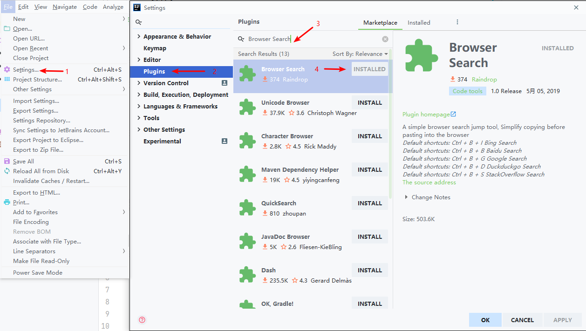

## Browser Search Plugin

### Introduction

This is a intellij Idea plugin. Provides the ability to quickly open the search engine and search selected content. Can be used by shortcut or right button.

[中文注释](https://github.com/727474430/BrowserSearch/blob/master/README_CN.md)

### Shortcut

<table>
    <tr>
        <th>Hot Key</th>
        <th>Description</th>
    </tr>
    <tr>
        <td align="center">Ctrl + B + I</td>
        <td align="center">Bing Search</td>
    </tr>
    <tr>
        <td align="center">Ctrl + B + B</td>
        <td align="center">Baidu Search</td>
    </tr>
    <tr>
        <td align="center">Ctrl + B + G</td>
        <td align="center">Google Search</td>
    </tr>
    <tr>
        <td align="center">Ctrl + B + D</td>
        <td align="center">DuckDuckGo Search</td>
    </tr>
    <tr>
        <td align="center">Ctrl + B + S</td>
        <td align="center">StackOverflow Search</td>
    </tr>
</table>

### How to use.

**Way one**

* Open Intellij IDEA -> Click File -> Click Settings -> Click Plugins

* Choose **Marketplace**. input **Browser Search** and find first content click install

* Restart Intellij IDEA ready to use
   
   

**Way two**

* Download BrowserSearch.jar

* Add To Intellij Idea Plugin

  

* Select need to search content Press the corresponding shortcut (right click)

  

  