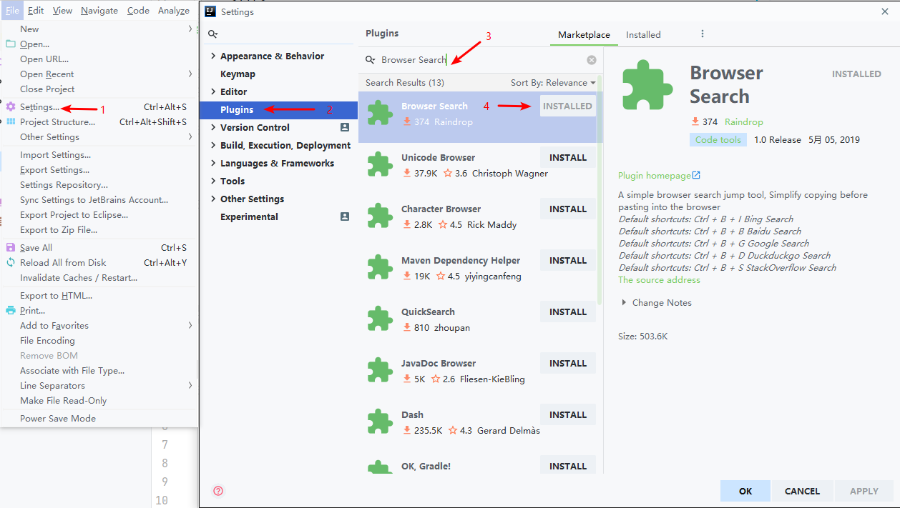
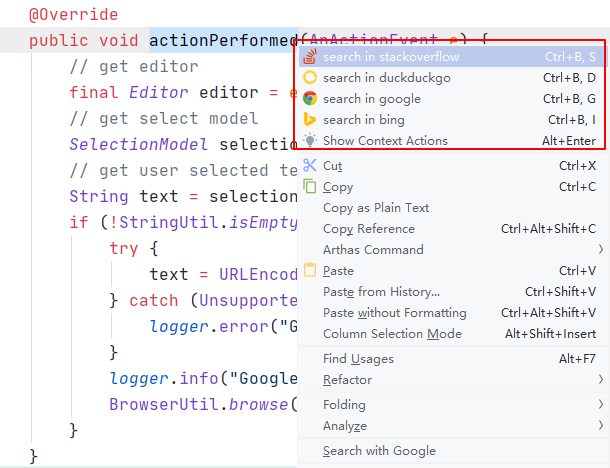

## Browser Search Plugin

### 介绍

这是一个Intellij Idea插件，提供了快速打开搜索引擎并搜索选中内容的功能，可以使用快捷看或右键使用

<table>
    <tr>
        <th>Hot Key</th>
        <th>描述</th>
    </tr>
    <tr>
        <td align="center">Ctrl + B + I</td>
        <td align="center">必应搜索</td>
    </tr>
    <tr>
        <td align="center">Ctrl + B + B</td>
        <td align="center">百度搜索</td>
    </tr>
    <tr>
        <td align="center">Ctrl + B + G</td>
        <td align="center">谷歌搜索</td>
    </tr>
    <tr>
        <td align="center">Ctrl + B + D</td>
        <td align="center">DuckDuckGo搜索</td>
    </tr>
    <tr>
        <td align="center">Ctrl + B + S</td>
        <td align="center">StackOverflow搜索</td>
    </tr>
</table>

### 如何使用

**第一种方式**

* 打开 Intellij IDEA -> 点击 File 菜单 -> 点击 Settings -> 点击 Plugins

* 选择 **Marketplace**, 搜索 **Browser Search** 找到第一个点击安装

* 重启 Intellij IDEA 即可使用
   
   

**第二种方式**

* 下载 BrowserSearch.jar

* 添加到Intellij Idea插件中

  

* 选择需要搜索的问题按下对应快捷键（右键点击）

  

  