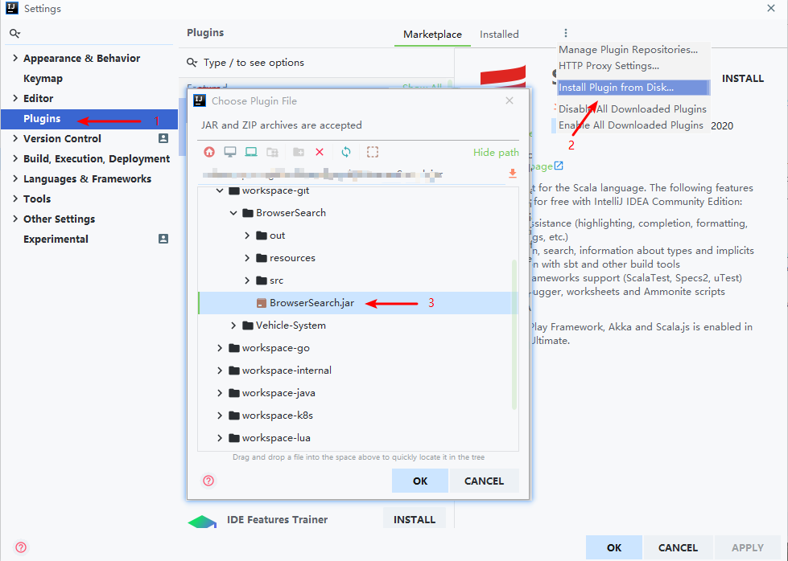

### 这是一个Intellij Idea插件，提供了内置的搜索方式，可以通过快捷键或右键点击使用

<table>
    <tr>
        <th>Hot Key</th>
        <th>Description</th>
    </tr>
    <tr>
        <td>Ctrl + B + I</td>
        <td>必应搜索</td>
    </tr>
    <tr>
        <td>Ctrl + B + B</td>
        <td>百度搜索</td>
    </tr>
    <tr>
        <td>Ctrl + B + G</td>
        <td>谷歌搜索</td>
    </tr>
    <tr>
        <td>Ctrl + B + D</td>
        <td>Duckduckgo搜索</td>
    </tr>
    <tr>
        <td>Ctrl + B + S</td>
        <td>StackOverflow搜索</td>
    </tr>
</table>

### 如何使用

**第一种**
* 打开 Intellij IDEA -> 点击 File 菜单 -> 点击 Settings -> 点击 Plugins

* 选择 **Marketplace**, 搜索 **Browser Search** 找到第一个点击安装

* 重启 Intellij IDEA 即可使用
   
   

**第二种**
* 下载 BrowserSearch.jar

* 添加到Intellij Idea插件中

  

* 选择需要搜索的问题按下对应快捷键（右键点击）

  

  